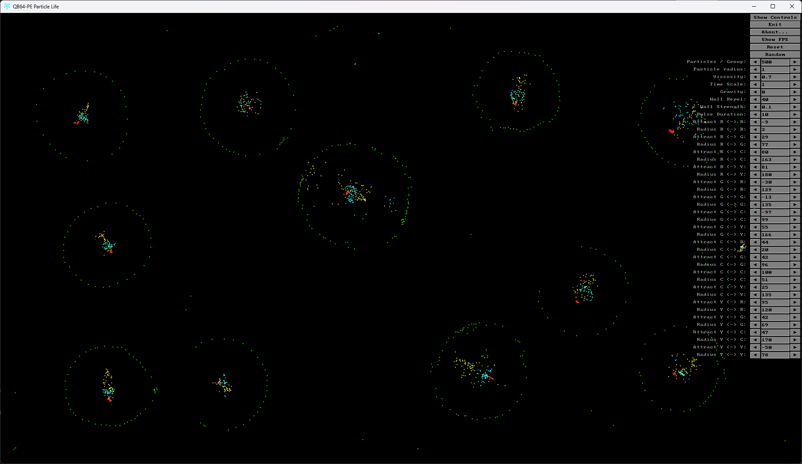
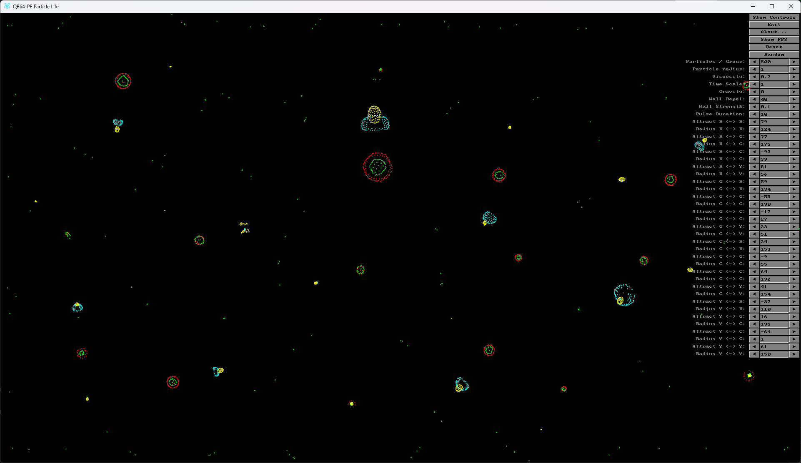
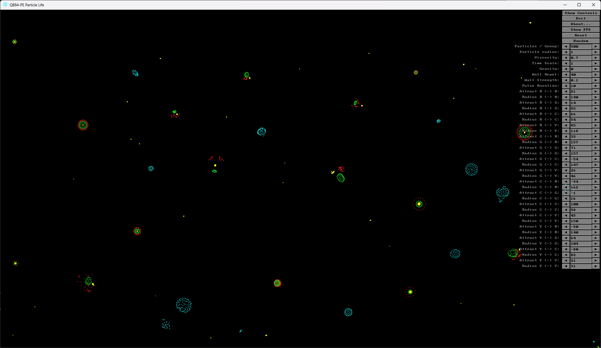
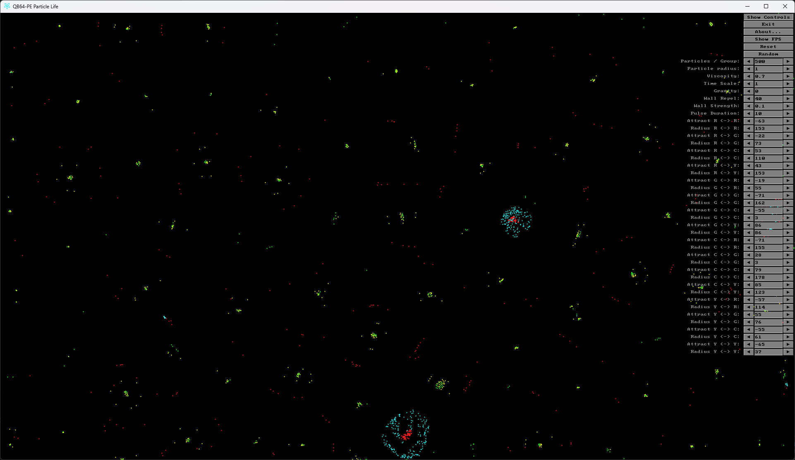

# Particle Life

Particle Life is a [particle life simulation](https://github.com/hunar4321/particle-life) written in [QB64-PE](https://www.qb64phoenix.com/). It simulates primitive artificial life using simple rules of attraction or repulsion among atom-like particles, producing complex self-organizing life-like patterns.






The project includes a GUI library based on ideas from [Terry Ritchie](https://www.qb64tutorial.com/)'s [Graphic Line Input Library](https://qb64phoenix.com/forum/showthread.php?tid=84) and [Button Library](https://qb64phoenix.com/forum/showthread.php?tid=82).

## Building

### Requirements

* The [latest version](https://github.com/QB64-Phoenix-Edition/QB64pe/releases/latest) of the [QB64-PE](https://www.qb64phoenix.com/) compiler.

### Build Instructions

1. Clone the repository with submodules:

    ```bash
    git clone --recursive https://github.com/a740g/Particle-Life.git
    cd Particle-Life
    ```

2. Compile `ParticleLife.bas` using the QB64-PE compiler:

    ```bash
    qb64pe.exe -x ParticleLife.bas
    ```

## Running

After building, run the executable:

```bash
./ParticleLife
```

Or open `ParticleLife.bas` in the QB64-PE IDE and press `F5` to compile and run directly.

## Using the GUI Library

To use the GUI library in your project, add the [Toolbox64](https://github.com/a740g/Toolbox64) repository as a [Git submodule](https://git-scm.com/book/en/v2/Git-Tools-Submodules).

## License

This project is licensed under the MIT License - see the [LICENSE.txt](LICENSE.txt) file for details.

## Attribution

Icon by [Everaldo / Yellowicon](https://iconarchive.com/artist/everaldo.html)
