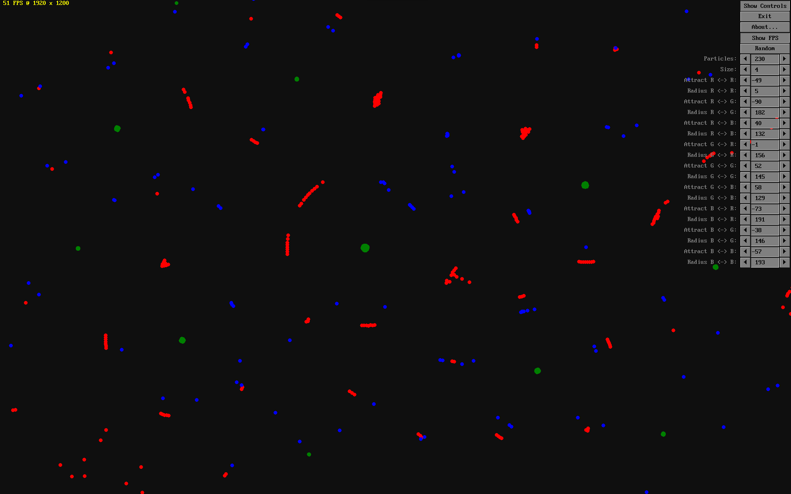

# Particle Life Simulation

This is a [QB64-PE](https://github.com/QB64-Phoenix-Edition/QB64pe) version of [Particle Life Simulation](https://github.com/hunar4321/particle-life). It is a simple program to simulate primitive artificial life using simple rules of attraction or repulsion among atom-like particles, producing complex self-organzing life-like patterns.

This also includes an early version of an immediate mode GUI library based on ideas from [Terry Ritchie](https://www.qb64tutorial.com/)'s [Graphic Line Input Library](https://qb64phoenix.com/forum/showthread.php?tid=84) and [Button Library](https://qb64phoenix.com/forum/showthread.php?tid=82). Thank you Terry!

Icon by [Everaldo / Yellowicon](https://iconarchive.com/artist/everaldo.html)

As usual, I do not accept responsibility for any effects, adverse or otherwise, that this code may have on you, your computer, your sanity, your dog, and anything else that you can think of. Use it at your own risk.

## Important Note

This uses new features introduced in [QB64-PE](https://github.com/QB64-Phoenix-Edition/QB64pe/releases) and as such may not work with anything else.
