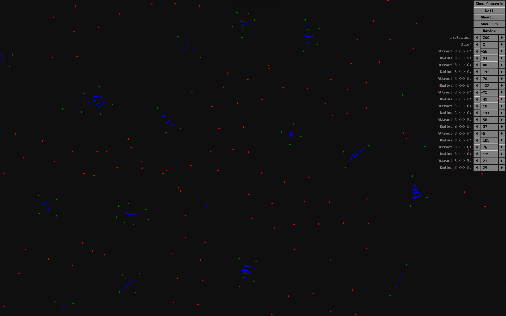
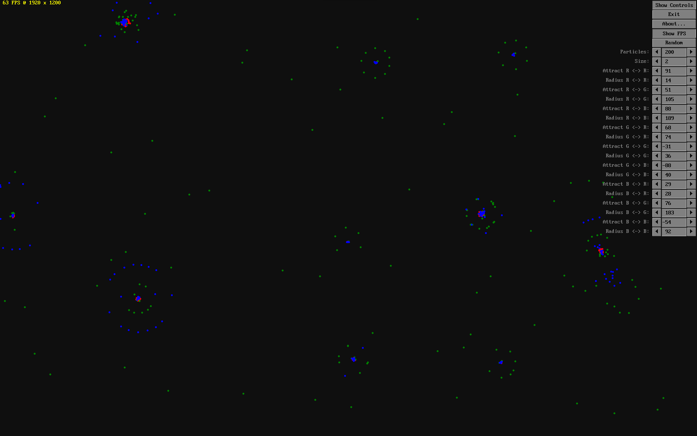
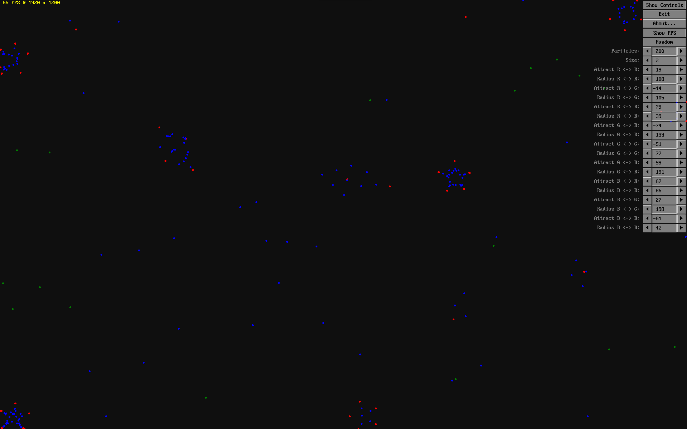

# PARTICLE LIFE SIMULATION

This is a [QB64-PE](https://github.com/QB64-Phoenix-Edition/QB64pe) version of [Particle Life Simulation](https://github.com/hunar4321/particle-life). It is a simple program to simulate primitive artificial life using simple rules of attraction or repulsion among atom-like particles, producing complex self-organzing life-like patterns.

This also includes an early version of an immediate mode GUI library based on ideas from [Terry Ritchie](https://www.qb64tutorial.com/)'s [Graphic Line Input Library](https://qb64phoenix.com/forum/showthread.php?tid=84) and [Button Library](https://qb64phoenix.com/forum/showthread.php?tid=82). Thank you Terry!

## USAGE

- Clone the repository to a directory of your choice
- Open Terminal and change to the directory using an appropriate OS command
- Run `git submodule update --init --recursive` to initialize, fetch and checkout git submodules
- Open *ParticleLife.bas* in the QB64-PE IDE and press `F5` to compile and run
- To use the GUI library in your project add the [Toolbox64](https://github.com/a740g/Toolbox64) repositiory as a [Git submodule](https://git-scm.com/book/en/v2/Git-Tools-Submodules)

## NOTES

- This requires the latest version of [QB64-PE](https://github.com/QB64-Phoenix-Edition/QB64pe)
- When you clone a repository that contains submodules, the submodules are not automatically cloned by default
- You will need to use the `git submodule update --init --recursive` command to initialize, fetch and checkout git submodules

## ASSETS

Icon by [Everaldo / Yellowicon](https://iconarchive.com/artist/everaldo.html)
